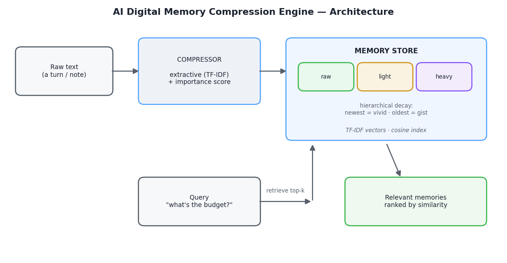
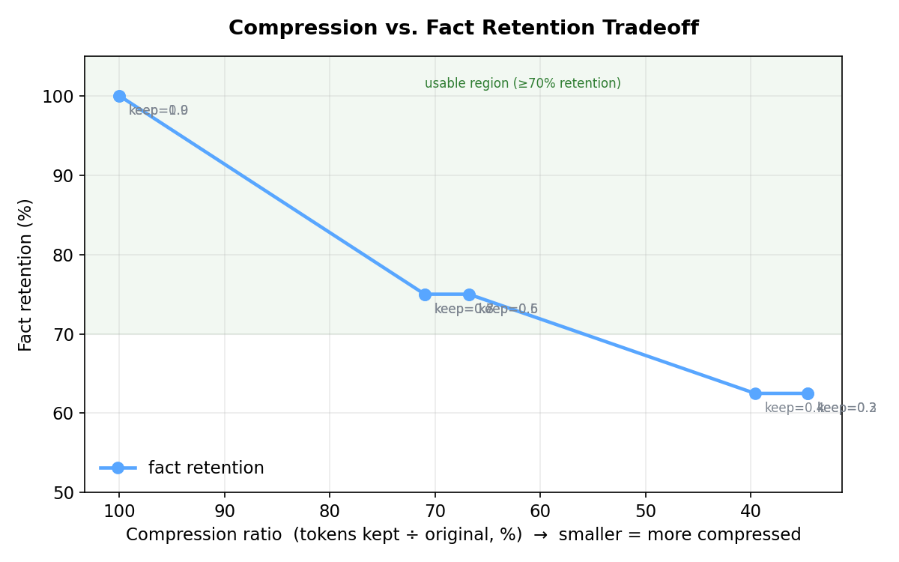

# 🧠 AI Digital Memory Compression Engine

> A semantic memory system that compresses long conversations into compact,
> retrievable **memories** — so an LLM (or any app) can recall key facts
> without storing the full history. Recent memories stay vivid; older ones
> decay to gist, the way human memory does.

<p align="center">
  
</p>

---

## Why this exists

LLMs have finite context windows. Dumping an entire conversation into every
prompt is wasteful and eventually impossible. This engine keeps a **hierarchy
of compressed memories** and retrieves only the relevant ones at query time —
saving tokens while preserving the facts that matter.

It ships in two forms:

- a **pure-Python engine** (zero dependencies — only the standard library), and
- a **single-file browser app** (`web/index.html`) that runs the whole thing
  in JavaScript with no install and no server.

---

## Key results

Measured on a 6-turn conversation with an 8-question fact-probe benchmark:

| Metric | Value |
|---|---|
| **Fact retention** (facts surviving compression) | **87.5%** |
| **Retrieval accuracy** (facts found in top-k) | **87.5%** |
| **Compression ratio** (tokens kept ÷ original) | **0.71** |
| **Space saved** | **28.6%** |

### The core tradeoff

Compress harder and you save more space but lose more facts. The engine was
swept across compression levels to map exactly where that line sits:

<p align="center">
  
</p>

The system holds **100% of facts down to a 0.9 ratio**, and stays above
**75% retention until roughly 0.4** — after which aggressive compression
starts dropping information. This curve is generated by
[`src/benchmark.py`](src/benchmark.py).

---

## How it works

1. **Compress** — each turn is reduced to its most salient sentences using
   TF-IDF centrality plus a keyword-salience score that favors dates, numbers,
   names, and decisions.
2. **Score importance** — every memory gets an importance value; important
   memories resist decay.
3. **Decay hierarchically** — the newest *N* memories stay `raw` (full text),
   older ones become `light`, the oldest become `heavy` (gist).
4. **Embed & index** — memories are turned into TF-IDF vectors for cosine
   similarity search.
5. **Retrieve** — a query returns the top-k most relevant memories.
6. **Evaluate** — QA probes measure whether facts survived compression
   (compressor quality) *and* whether they were retrievable (embedder quality),
   kept separate on purpose.

---

## Run it

### Option A — Browser (no install)
Open `web/index.html` in any browser. Click **Load sample** to see it compress
a conversation and answer a query, or type your own notes and ask questions.

### Option B — Python engine (no dependencies)
```bash
python src/engine.py      # runs the full demo + evaluation
python src/chat.py        # interactive: type memories, /ask questions
```

### Reproduce the benchmark & charts
```bash
python src/benchmark.py         # writes benchmark_results.csv (pure python)
python src/make_chart.py        # renders docs/tradeoff.png  (needs matplotlib)
```

### Run the tests
```bash
python -m unittest discover -s tests -v
```

---

## Project structure

```
├── src/
│   ├── engine.py            # core engine: compression, decay, retrieval, eval
│   ├── chat.py              # interactive CLI
│   ├── benchmark.py         # compression-vs-retention sweep
│   └── make_chart.py        # renders the tradeoff chart
├── web/
│   └── index.html           # self-contained browser app (JS port of the engine)
├── docs/
│   ├── architecture.png
│   └── tradeoff.png
├── tests/
│   └── test_engine.py       # 11 unit tests (stdlib unittest)
└── README.md
```

---

## Design decisions

- **Two separate metrics.** Retention and retrieval are measured independently
  so a failure can be traced to the *compressor* or the *embedder*, not
  guessed at.
- **Importance-aware decay.** A memory full of dates and decisions resists
  dropping to the lowest tier — mirroring how salient memories persist.
- **Zero-dependency core.** The engine uses only the standard library, so it
  runs on locked-down machines where compiled packages (numpy, faiss) are
  blocked. A stronger sentence-transformer embedder can be swapped in for
  higher retrieval accuracy.

---

## Limitations & future work

- **Sentence-level compression** occasionally drops a fact when it shares a
  turn with higher-scoring sentences (e.g. a "500 signups" goal sitting next
  to budget and date figures). **Fact-level extraction** — pulling structured
  facts instead of whole sentences — would fix this.
- **TF-IDF retrieval** is lexical; it misses paraphrases. Swapping in a neural
  embedder (`sentence-transformers`) raises retrieval accuracy at the cost of
  a dependency and a model download.
- **Decay is position-based.** Adding recency + access-frequency (memories you
  query often stay vivid) would make it more lifelike.
- **No persistence yet** beyond the CLI's `/save` and `/load`.

---

## License

MIT — see [LICENSE](LICENSE).
